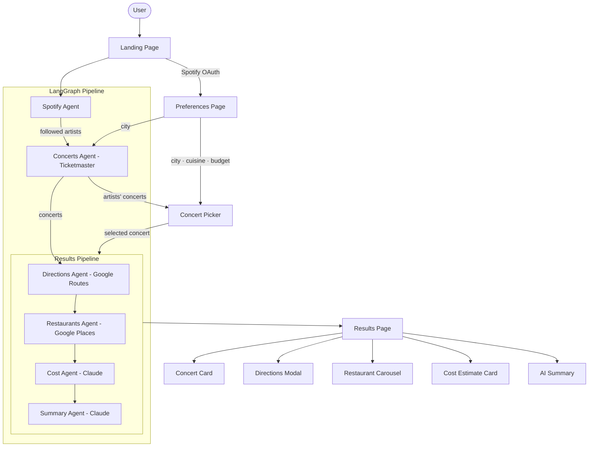

# Sonic Curator

The Sonic Curator is a multi-agent AI system that plans a personalized night out based on your Spotify music taste. Connect your Spotify account, pick an upcoming concert from your followed artists, and the app handles the rest — directions, restaurant recommendations, and a cost estimate for the night.

Built with LangGraph, the system orchestrates a pipeline of 6 specialized agents. Each agent is responsible for one domain of the plan and writes its findings into a shared typed state that propagates through the graph.

### How it works
1. Spotify Agent — reads your followed artists via the Spotify API
2. Concerts Agent — searches Ticketmaster for upcoming shows from those artists in the city of your preference
3. Directions Agent — fetches transit and driving directions to the selected venue via Google Routes API
4. Restaurants Agent — finds nearby highly-rated restaurants filtered by your cuisine preference and budget via Google Places API
5. Cost Agent — estimates the total cost of the night using ticket data, transport, and dinner price level
6. Summary Agent — synthesizes all agent outputs into a personalized night out plan via Claude

## Wesbite
Live Demo: https://concert-planner.vercel.app

## Video Demo

## Architecture

