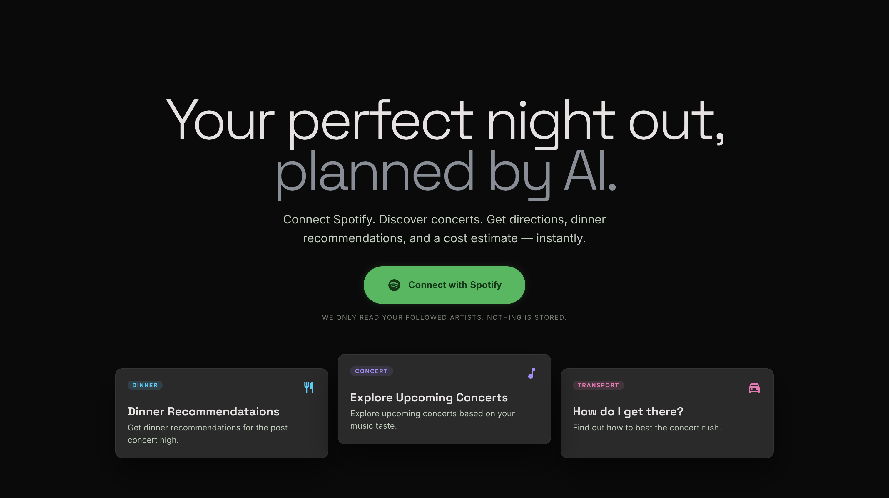
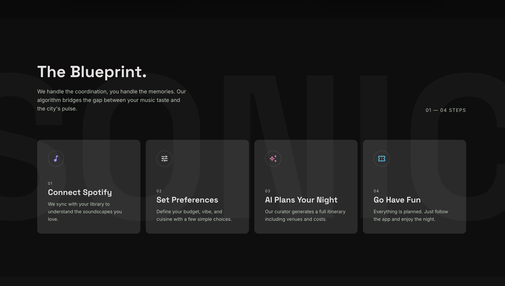
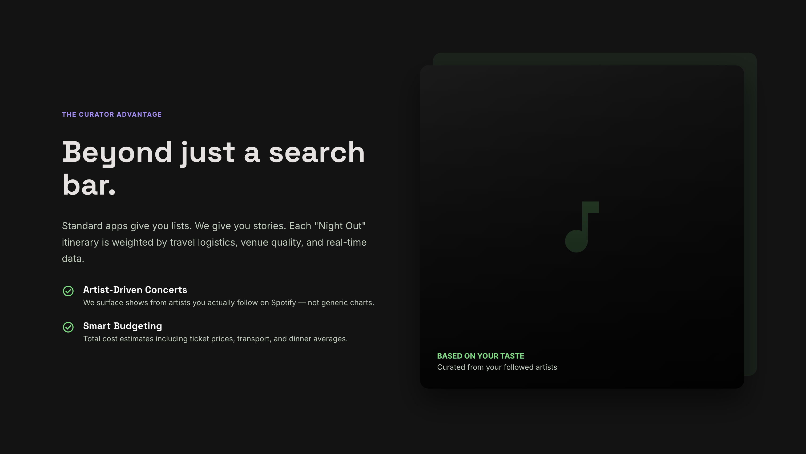
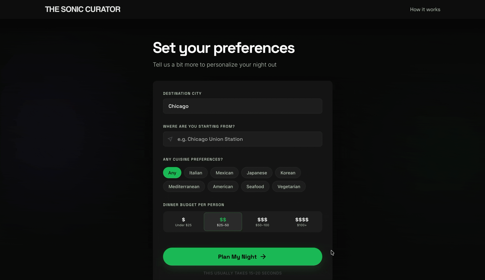
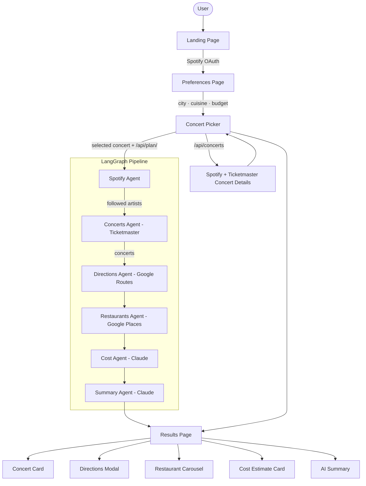

# Sonic Curator


The Sonic Curator is a multi-agent AI system that plans a personalized night out based on your Spotify music taste. Connect your Spotify account, pick an upcoming concert from your followed artists, and the app handles the rest — directions, restaurant recommendations, and a cost estimate for the night.

Built with LangGraph, the system orchestrates a pipeline of 6 specialized agents. Each agent is responsible for one domain of the plan and writes its findings into a shared typed state that propagates through the graph.

### How it works
1. Spotify Agent — reads your followed artists via the Spotify API
2. Concerts Agent — searches Ticketmaster for upcoming shows from those artists in the city of your preference
3. Directions Agent — fetches transit and driving directions to the selected venue via Google Routes API
4. Restaurants Agent — finds nearby highly-rated restaurants filtered by your cuisine preference and budget via Google Places API
5. Cost Agent — estimates the total cost of the night using ticket data, transport, and dinner price level
6. Summary Agent — synthesizes all agent outputs into a personalized night out plan via Claude

## Wesbite
Live Demo: https://concert-planner.vercel.app

## Video Demo

### Home Page
<div align="left">
  
  
  
</div>


### Spotify Login
<div align="left">
  
</div>

### Preferences Page
<div align="left">
  
</div>

### Concert Picker + Loader


### Results Page
<div align="left">
  
</div>

## Architecture



## Key Features

### Spotify-Driven Concert Discovery
Fetches the user's followed artists directly from Spotify and cross-references their names with the user's selected city as search keywords against the Ticketmaster Discovery API. Returns all upcoming concerts matching those artists, not just the top result, so the user can browse and pick the show they actually want to attend.

### Concert Picker
Rather than auto-selecting a concert, the app presents all matching shows in a card grid — artist, venue, date, and ticket price where available. The user selects the specific concert they want to plan around, and that selection drives every downstream agent.

### Directions to the Venue
The selected concert's venue coordinates are passed directly to the Directions Agent, which queries the Google Routes API for both driving and transit options. Results include step-by-step directions — turn-by-turn for driving and stop-by-stop line and transfer information for transit, surfaced in an interactive bottom sheet modal on the results page.

### Intelligent Restaurant Recommendations
The selected venue's coordinates are passed to the Restaurants Agent, which searches Google Places API for highly rated restaurants within an 800 meter (~10 minute walk) radius. Restaurants are filtered by the user's cuisine preference and budget ceiling, and ranked by rating. The agent accounts for concert timing by building a 2-hour window; returning only the restaurants that would be open for at least 1 hour after the user is seated — so recommendations work for both pre-show dining and a late dinner after the concert.

### Cost Estimation
The Cost Agent uses Claude to reason about the realistic price of the full night. When Ticketmaster does not return ticket pricing — which is common for festivals and major venues — Claude approximates a price range based on artist popularity and venue type. Transit costs are estimated using city-specific knowledge of transit fares and typical parking rates near the venue. Dinner cost is approximated from the price level of the top recommended restaurant. The result is a total range broken down by tickets, transport, and dinner.

### AI Night Out Summary
A final Summary Agent passes the complete state — artists, concert details, directions, restaurants, and cost breakdown — to Claude, which synthesizes everything into a concise, conversational night out plan covering the show, how to get there, where to eat, what it will cost, and a few practical city-specific tips for the night.

## Tech Stack

| Layer | Technology |
|-------|------------|
| Frontend | React, Vite, React Router, Axios, React Markdown |
| Backend | Python, FastAPI, LangGraph |
| AI | Claude |
| Music | Spotify API, Spotipy |
| Concerts | Ticketmaster Discovery API |
| Directions & Restaurants | Google Routes API, Google Places API, Google Geocoding API |
| Infrastructure | Railway (backend), Vercel (frontend) |

## Local Setup

### Prerequisites
1. Python 3.11+
2. uv

### Backend
```bash
cd backend
uv install
cp .env.example .env
# Fill in your API keys in .env
uv run uvicorn app.main:app --reload
```

### Frontend
```bash
cd frontend
npm install
cp .env.example .env
# Set VITE_API_URL=http://127.0.0.1:8000
npm run dev
```

Open http://localhost:5173 to access the application.


## Environment Variables

In your .env file, fill in these API keys

| Variable | Description |
|----------|-------------|
| `SPOTIFY_CLIENT_ID` | Spotify Developer app client ID |
| `SPOTIFY_CLIENT_SECRET` | Spotify Developer app client secret |
| `SPOTIFY_REDIRECT_URI` | http://127.0.0.1:8000/callback |
| `ANTHROPIC_API_KEY` | Anthropic API key |
| `TICKETMASTER_API_KEY` | Ticketmaster Discovery API key |
| `GOOGLE_MAPS_API_KEY` | Google Cloud API key — enables Routes, Places, and Geocoding |


## Deploying

Railway makes it accessible to deploy a Python backend by creating a seamless CI/CD integration with your GitHub repo.

| Feature | Railway | Render |
|----------|-------------|----|
|Free Tier |	$5 for the first month |	750 hours / month |
|Server Spin Down |	No |	Yes, after 15 mins of inactivity | 

1. The frontend of the application was developed using React + Vite, and Vercel offers a free tier to deploy the framework.
2. To deploy on Railway, first connect the repo that needs to be deployed. This is  a monorepo; select the backend folder as your root folder.
3. Add all the environment variables to Railway and deploy. Once deployed, Railway will generate a URL for the app.
```bash
https://your-railway-url.up.railway.app/callback
```
Add this link to your Redirect URIs on the Spotify Dashboard in your application.
4. Update the environment variable in Railway for SPOTIFY_REDIRECT_URI
```bash
SPOTIFY_REDIRECT_URI=https://your-railway-url.up.railway.app/callback
```
5. Connect your repo to Vercel, select root directory as frontend and framework as Vite and add an environment variable
```bash
VITE_API_URL=https://your-railway-url.up.railway.app
```
6. Deploy, and Vercel will give you a URL to access the application. Add the following environment variable to Railway.
```bash
FRONTEND_URL=https://your-vercel-url.vercel.app
```
7. The application is deployed and can be accessed from https://your-vercel-url.vercel.app


